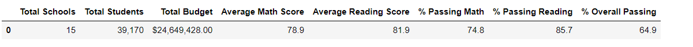

# School_District_Analysis

Overview of the school district analysis: Explain the purpose of this analysis.

Prepare and analyze all standardized test data from a school district for analysis, reporting and presentation to provide insights about performance trends and patterns.
These insights are to inform discussions and strategic decisions at the school and district level. 

Analyze data on student funding and student's standardized test scores (Math and reading) and various information on school's they attend
Task: Aggregate the data and showcase trends in school performance. This will assist the school board and superintendent in making decisions regarding the school budgets
and priorities. While working on this task, we'll need to mantain the data confidential as part of the Family Educational Rights and Privacy Act (FERPA) of 1974 which
protects the privacy of student education records. 
Additionally the school district provided that the standardized test scores for ninth grade students at Thomas High School were incorrect, and they requested for updated data summaries.

After analyzing the data, it was best to only replace the ninth grade math and reading scores at Thomas High School instead of removing them because this will provide the best accuracy while keeping all other data associated with this student group intact.

The Math and Reading scores were replaced with "NaN", which means a "Not-a-Number" value resulting in a closer representation of the original data.

Results: Using bulleted lists and images of DataFrames as support, address the following questions.

## District Summary
The average math score and passing percentages and the overall passing percentage among the 15 high schools in the school district changed, the average math score dropped 1.9%, the average reading score stayed the same, the percentage passing math dropped 1.8%, the percentage passing reading dropped 1.7%, and the overall passing percent dropped 1.9%.

## School Summary

When assessing school summaries and performing schools, the score replacements did affect the ranking of the top five performing schools. Thomas High School ranked second place in the top five performing schools with a 91% overall passing. After replacing both math and reading scores, Thomas High School was taken out of the top five category since they now display a 65% overall passing. On the plus side, these changes did not place Thomas High School among the bottom five performing schools. Those ranks remained the same. Per the revised School Summary, Thomas High School now ranks 8th place among 15 high schools in the district.

## The ninth graders’ math and reading scores from Thomas High School.
Another plus side from this data replacement is that it did not change the math and reading scores by grade. Granted, both the average math and reading score summaries were stratisfied by school and grade level. As shown above, the summary tables display "NaN" for ninth grade at Thomas High School whereas the remaining data remained intact.
## Scores by school spending
When reviewing the School Spending summary, this data change did not impact the spending ranges for either the average math scores or average reading scores. 
## Scores by school size
When reviewing the School Size summary, removing the ninth grade scores did not affect the average math and reading scores, but it did affect the passing percentages for medium-sized schools. In this category, % passing math, % passing reading, and % overall passing dropped. Before the data change, the School Size summary showed that medium-sized school had a high performance compared to small and large schools. Given the data change, medium size school are the second in performance.
## Scores by school type
In reviewing the last summary on School Types, this data change also affected the passing percentages that compared charter and district schools. Fortunately, it did not affect the average scores for these two school types. Removing the scores resulted in a reduction in charter school's passing percentages.
